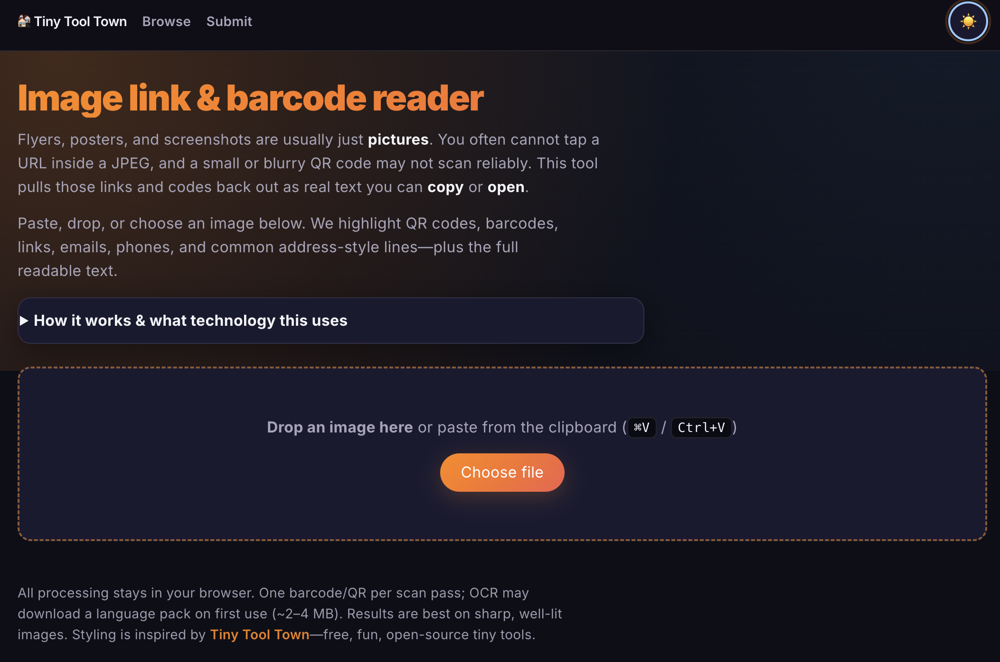

# Image Link & Barcode Reader

Paste or drop a flyer or screenshot. This tiny web app highlights **QR codes, barcodes, URLs, emails, phones**, and simple **street-style addresses** so you can copy or open them—plus the **full OCR text** in one place.



**Live demo:** [https://black-moss-09ab0f610.7.azurestaticapps.net](https://black-moss-09ab0f610.7.azurestaticapps.net) (Azure Static Web Apps)

## Why it exists

Phones do not always let you tap text inside an image. This runs **entirely in your browser** (no upload server) and uses ZXing for codes and Tesseract.js for text layout.

## Run locally

```bash
npm install
npm run dev
```

Then open the URL shown in the terminal (usually `http://localhost:5173`).

```bash
npm run build   # production bundle
npm run preview # serve dist locally
```

## Stack

Vite, React, TypeScript, [@zxing/browser](https://github.com/zxing-js/browser), [tesseract.js](https://github.com/naptha/tesseract.js).

## License

MIT — see [LICENSE](./LICENSE).
